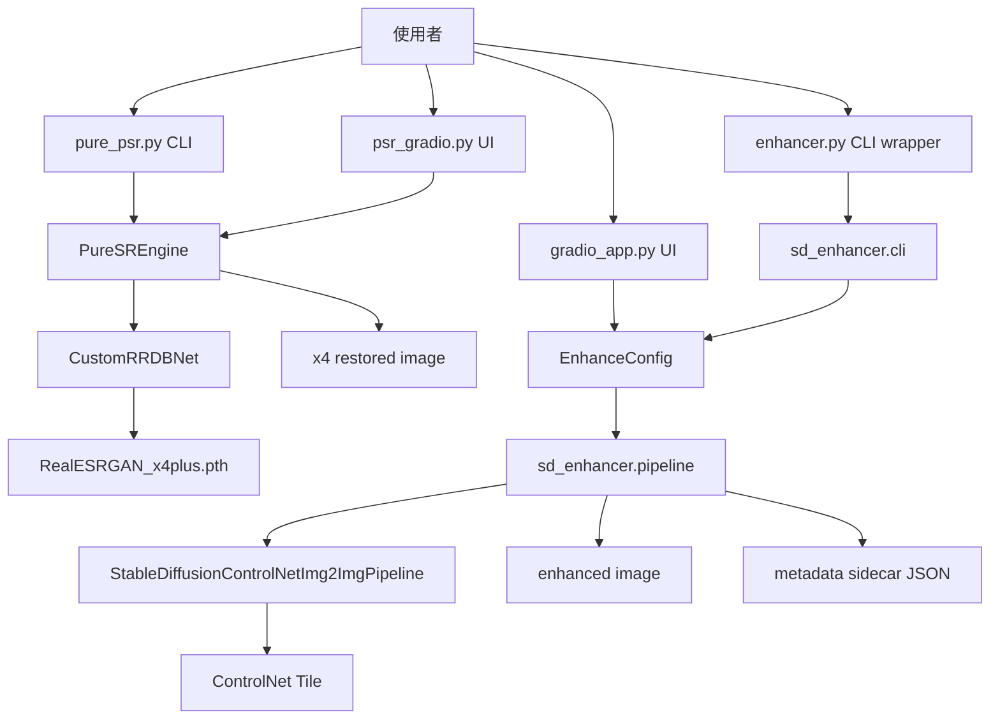
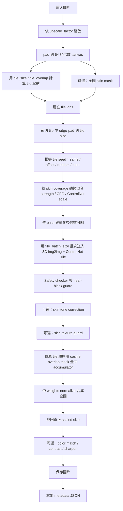
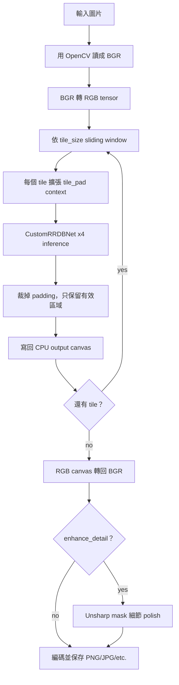

# SD Restoration

這個專案包含兩條影像修復流程：

- **Pure PSR / RealESRGAN x4**：使用本地 RRDBNet 實作與 `RealESRGAN_x4plus.pth` 權重，做穩定的 tiled x4 超解析。
- **SD Enhancer**：使用 Stable Diffusion + ControlNet Tile 做 promptable 影像修復，支援 tiled generation、皮膚保護、tile seed reproducibility、metadata sidecar，以及 Gradio UI。

兩條流程都以 tile 為核心，目標是在大圖修復時控制 VRAM/RAM 用量，同時維持輸出品質。

## 專案架構圖



## 檔案結構

| 路徑 | 作用 |
| --- | --- |
| `enhancer.py` | SD enhancer 的薄 wrapper，CLI 轉呼叫 `sd_enhancer.cli.main`，API 轉呼叫 `sd_enhancer.pipeline.enhance_image`。 |
| `sd_enhancer/config.py` | 預設模型、prompt、允許值與 `EnhanceConfig`。 |
| `sd_enhancer/presets.py` | SD enhancer presets：`photo`、`anime`、`denoise`、`upscale`、`low-vram`。 |
| `sd_enhancer/cli.py` | CLI 參數解析、batch 收集、輸出路徑解析、pipeline 重用。 |
| `sd_enhancer/pipeline.py` | 模型載入、tiled SD generation、skin mask、tile blending、postprocess、metadata 輸出。 |
| `sd_enhancer/tiling.py` | tile 起點計算與 overlap blend mask。 |
| `sd_enhancer/io.py` | 圖片掃描、輸出寫檔、JSON sidecar 產生。 |
| `gradio_app.py` | SD enhancer 的 Gradio 產品化介面。 |
| `pure_psr.py` | Pure RealESRGAN-style x4 restoration CLI 與 backend engine。 |
| `psr_gradio.py` | Pure PSR 的 Gradio 介面。 |
| `RealESRGAN_x4plus.pth` | `PureSREngine` 使用的 RealESRGAN 權重。 |
| `input/` | 建議的本機輸入資料夾。 |
| `output/` | 建議的本機輸出資料夾。 |

## 環境

主要依賴如下：

| 工作流 | 主要套件 |
| --- | --- |
| Pure PSR | `torch`、`opencv-python`、`numpy` |
| Gradio apps | `gradio`、`Pillow` |
| SD Enhancer | `torch`、`diffusers`、`Pillow`、`numpy`、可選 `xformers` |

若 `gradio_app.py` 可以開啟，但按下 render 後出現 `No module named 'diffusers'`，代表目前環境缺少 SD enhancer backend 依賴，需要先在 active environment 內安裝 `diffusers` 等套件。

## 快速開始

### Pure PSR CLI

單張圖片：

```bash
python pure_psr.py input/example.jpg --output output/example_pure_psr.png --device cuda:0 --overwrite
```

批次處理：

```bash
python pure_psr.py --input-dir input --recursive --output-dir output --format png --overwrite
```

### Pure PSR Gradio

```bash
python psr_gradio.py --host 127.0.0.1 --port 7860
```

### SD Enhancer CLI

單張圖片：

```bash
python enhancer.py -i input/example.jpg -o output/example_enhanced.png --preset photo --seed 42 --overwrite
```

批次處理：

```bash
python enhancer.py --input-dir input --recursive -o output --preset low-vram --overwrite
```

針對皮膚穩定性的照片修復範例：

```bash
python enhancer.py -i input/example.jpg -o output/example_skin_safe.png \
  --preset photo \
  --seed 42 \
  --tile-seed-mode same \
  --skin-protect \
  --skin-protect-mode tone \
  --skin-texture-guard \
  --skin-texture-guard-strength 0.72 \
  --skin-guidance-scale 3.8 \
  --skin-conditioning-scale 0.65 \
  --skin-tile-size 640 \
  --strength 0.20 \
  --guidance-scale 4.2 \
  --conditioning-scale 0.8 \
  --tile-overlap 128 \
  --overwrite
```

### SD Enhancer Gradio

```bash
python gradio_app.py --host 127.0.0.1 --port 7860
```

`gradio_app.py` 支援兩種輸入：

- 單張：使用 `Input Image` 與 `Run Enhancement`，輸出 before/after preview。
- 批次：使用 `Batch Images` 選多張圖，按 `Run Batch` 後會透過 Gradio queue 逐張處理；完成的 PNG 會逐一加入 `Batch Gallery`，最後提供 `enhanced_batch.zip` 一次下載整批輸出。

兩個 Gradio app 預設都使用 `7860`。若要同時啟動，請把其中一個換到其他 port：

```bash
python gradio_app.py --host 127.0.0.1 --port 7861
```

## SD Enhancer Pipeline



重點：

- tile 位置使用固定 stride：`tile_size - tile_overlap`；邊緣 tile 以 padding 處理，而不是把最後一塊往回拉。
- skin detection 只在 resized full image 上計算一次，再依 tile crop/pad，避免每個 tile 各自判斷造成 mask 不連續。
- `skin-protect-mode tone` 只校正低頻膚色，不額外跑第二次 SD pass。
- skin-heavy tile 會動態降低 `strength`、`guidance_scale` 與 `conditioning_scale`，避免模型在低解析度皮膚區過度重繪。
- tile generation 會依 pass 與近似參數分組，將相同尺寸 tile 以 `tile_batch_size` 批次送入 UNet/ControlNet；只有 CUDA OOM fallback 才會呼叫 `torch.cuda.empty_cache()` 並自動拆小批次重試。
- `skin-texture-guard` 會做 hierarchical blending：非皮膚區保留 SD detail path，皮膚區回到 Lanczos upscaled natural path，只混入少量低頻 tone delta。
- 若偵測到皮膚且設定了 `skin_tile_size`，pipeline 會使用較大的 skin-aware tile size，減少臉部與皮膚區域的拼接點。
- CUDA FP16 pipeline 會在 VAE decode 當下臨時切到 FP32，decode 完還原 VAE dtype，降低大片相似膚色區的條紋與 near-black 風險，同時避免 img2img encode 階段 dtype mismatch。
- tile output 會使用 cosine overlap mask 加權累積，再用 total weights normalize。
- near-black tile 會視為錯誤；若是 FP16 VAE decode 問題，會嘗試一次 FP32 VAE decode retry。

## Pure PSR Pipeline



重點：

- `PureSREngine` 會載入 `RealESRGAN_x4plus.pth`，如果權重不存在會嘗試下載。
- CUDA 可用時使用 FP16；CPU 使用 FP32。
- 大圖輸出會組在 CPU `uint8` canvas，降低 GPU 記憶體壓力。
- 遇到 CUDA OOM 時，CLI 可將 tile size 降低後重試。

## SD Enhancer Presets

| Preset | 用途 | 主要預設 |
| --- | --- | --- |
| `photo` | 一般照片修復 | x2、`strength=0.20`、`conditioning_scale=0.8`、`guidance_scale=4.2`、`tile_batch_size=2`、skin guard on |
| `anime` | 動漫插畫修復 | x2、`strength=0.32`、`guidance_scale=8.0`、skin guard off |
| `denoise` | 同尺寸降噪清理 | x1、`strength=0.18`、`conditioning_scale=0.75`、skin guard strength `0.75` |
| `upscale` | 較積極的放大 | x4、`strength=0.20`、`conditioning_scale=0.8`、skin guard strength `0.75` |
| `low-vram` | 低 VRAM workflow | x2、`strength=0.20`、`tile_size=384`、`tile_batch_size=1`、sequential CPU offload |

## SD Enhancer 參數定義

### 輸入與輸出

| 參數 | 型別 / choices | 預設 | 定義 |
| --- | --- | --- | --- |
| `-i`, `--image` | image path | 與 `--input-dir` 擇一必填 | 單張輸入圖片。 |
| `--input-dir` | directory path | 與 `--image` 擇一必填 | 批次輸入資料夾。 |
| `--recursive` | flag | `False` | 遞迴掃描 `--input-dir`。 |
| `-o`, `--output` | path | 必填 | 單張模式為輸出檔案；batch 模式為輸出資料夾。 |
| `--overwrite` | flag | `False` | 允許覆蓋既有輸出。 |

### Preset 與 Prompt

| 參數 | 型別 / choices | 預設 | 定義 |
| --- | --- | --- | --- |
| `--preset` | `photo`, `anime`, `denoise`, `upscale`, `low-vram` | `photo` | 載入 prompt 與 generation 預設。 |
| `--prompt` | string | preset prompt | 正向 prompt。 |
| `--prompt-file` | text path | none | 從文字檔讀取正向 prompt。 |
| `--negative-prompt` | string | preset negative prompt | 反向 prompt。 |
| `--negative-prompt-file` | text path | none | 從文字檔讀取反向 prompt。 |
| `--model-id` | string | preset model | Stable Diffusion base model。預設為 `SG161222/Realistic_Vision_V5.1_noVAE`。 |
| `--controlnet-id` | string | preset controlnet | ControlNet model。預設為 `lllyasviel/control_v11f1e_sd15_tile`。 |

### Generation

| 參數 | 型別 / choices | 預設 | 定義 |
| --- | --- | --- | --- |
| `--upscale-factor` | float > 0 | preset value | generation 前的 resize 倍率。 |
| `--strength` | float 0-1 | preset value | img2img denoising strength；越高越容易重畫。 |
| `--conditioning-scale` | float > 0 | preset value | ControlNet Tile conditioning 強度。 |
| `--guidance-scale` | float > 0 | preset value | classifier-free guidance scale。 |
| `--steps` | positive int | preset value | denoising inference steps。 |
| `--seed` | int | none | reproducibility seed；不填則為隨機生成。 |
| `--tile-size` | positive int，需為 8 的倍數 | preset value | inference tile size；越小越省 VRAM。 |
| `--tile-overlap` | non-negative int，需小於 `tile-size` | preset value | 相鄰 tile 的 overlap，用於降低接縫。 |
| `--tile-seed-mode` | `same`, `offset`, `random` | preset value | 如何從 `--seed` 推導每個 tile 的 seed。 |
| `--tile-batch-size` | positive int | preset value | 每次送入 UNet/ControlNet 的 tile 數量；OOM 時會清理 CUDA cache 並自動拆小批次重試。 |

### Skin Protection

| 參數 | 型別 / choices | 預設 | 定義 |
| --- | --- | --- | --- |
| `--skin-protect`, `--no-skin-protect` | boolean | preset value | 啟用或關閉 full-image skin mask 保護。 |
| `--skin-protect-mode` | `tone`, `dual-pass` | preset value | `tone` 在一般 generation 後校正膚色；`dual-pass` 會對皮膚區額外跑低 strength SD pass。 |
| `--skin-strength` | float 0-1 | preset value | skin-heavy tile 的目標 denoising strength；`dual-pass` skin pass 也使用這個值。 |
| `--skin-guidance-scale` | float > 0 | preset value | skin-heavy tile 的目標 CFG，pipeline 會依 skin coverage 從一般 `guidance_scale` 混合到此值。 |
| `--skin-conditioning-scale` | float > 0 | preset value | skin-heavy tile 的目標 ControlNet scale，pipeline 會依 skin coverage 從一般 `conditioning_scale` 混合到此值。 |
| `--skin-tile-size` | positive int，需為 8 的倍數 | preset value | 偵測到皮膚時可使用的較大 tile size，用於降低臉部/皮膚拼接點。 |
| `--skin-texture-guard`, `--no-skin-texture-guard` | boolean | preset value | 在 skin mask 內抑制不穩定 generated skin texture。 |
| `--skin-texture-guard-strength` | float 0-1 | preset value | 高頻皮膚紋理抑制強度。 |

### Postprocess

| 參數 | 型別 / choices | 預設 | 定義 |
| --- | --- | --- | --- |
| `--sharpen` | flag | `False` | tiled generation 後套用 light unsharp mask。 |
| `--contrast` | flag | `False` | tiled generation 後套用輕微 contrast。 |
| `--match-color-input` | flag | `False` | 將輸出低頻色調拉回 upscaled input。 |

### Runtime

| 參數 | 型別 / choices | 預設 | 定義 |
| --- | --- | --- | --- |
| `--device` | `auto`, `cpu`, `cuda` | `auto` | runtime device；`auto` 會優先選 CUDA。 |
| `--dtype` | `auto`, `fp16`, `fp32` | `auto` | torch dtype；`auto` 在 CUDA 用 FP16，CPU 用 FP32。 |
| `--disable-xformers` | flag | `False` | 不嘗試啟用 xFormers attention。 |
| `--offload` | `none`, `model`, `sequential` | preset value | CPU offload mode；`sequential` 最省 VRAM，但最慢。 |

### Logging

| 參數 | 型別 / choices | 預設 | 定義 |
| --- | --- | --- | --- |
| `-v`, `--verbose` | count flag | `0` | 啟用 DEBUG logging。 |
| `--quiet` | flag | `False` | 只顯示 warning/error；若同時設定 `--log-level`，以 `--log-level` 為準。 |
| `--log-level` | `DEBUG`, `INFO`, `WARNING`, `ERROR`, `CRITICAL` | `INFO` | 明確指定 logging level。 |
| `--log-file` | path | none | 將同一份 logs 額外寫入檔案。 |

## EnhanceConfig 欄位定義

`EnhanceConfig` 是 CLI 與 Gradio app 共用的內部 API。

| 欄位 | 定義 |
| --- | --- |
| `image_path`, `output_path` | 輸入與輸出路徑。 |
| `prompt`, `negative_prompt` | 正向與反向 prompt。 |
| `model_id`, `controlnet_id` | base model 與 ControlNet 的 Hugging Face ID。 |
| `upscale_factor` | inference 前的 resize 倍率。 |
| `strength` | 一般 img2img denoising strength。 |
| `conditioning_scale` | ControlNet conditioning 強度。 |
| `guidance_scale` | classifier-free guidance scale。 |
| `steps` | inference steps。 |
| `seed` | 可選的 global seed。 |
| `device`, `dtype`, `use_xformers`, `offload_mode` | runtime placement 與 memory control。 |
| `overwrite` | 是否允許覆蓋輸出。 |
| `tile_size`, `tile_overlap`, `tile_seed_mode`, `tile_batch_size` | tile 幾何、seed 行為與批次推論大小。 |
| `preset` | preset 名稱或呼叫來源。 |
| `skin_protect`, `skin_protect_mode`, `skin_strength` | skin mask 與 skin-region denoising 權限控制。 |
| `skin_guidance_scale`, `skin_conditioning_scale`, `skin_tile_size` | skin-heavy tile 的 CFG、ControlNet scale 與 tile size 區域引導。 |
| `skin_texture_guard`, `skin_texture_guard_strength` | hierarchical skin texture blending 強度。 |
| `sharpen`, `contrast`, `match_color_input` | 最終 postprocess 控制。 |

## Pure PSR 參數定義

| 參數 | 型別 / choices | 預設 | 定義 |
| --- | --- | --- | --- |
| `inputs` | image paths | none | 一張或多張輸入圖片。 |
| `--input-dir` | directory path | none | batch 輸入資料夾。 |
| `--recursive` | flag | `False` | 遞迴掃描 `--input-dir`。 |
| `--output` | file path | none | 單張輸出路徑，只能搭配單張輸入。 |
| `--output-dir` | directory path | `output` | batch 輸出資料夾。 |
| `--format` | `png`, `jpg`, `keep` | `png` | batch 輸出格式。 |
| `--device` | torch device string | `cuda:0` | runtime device，例如 `cuda:0` 或 `cpu`。 |
| `--tile-size` | int >= 64，且需為 8 的倍數 | `256` | RealESRGAN inference tile size。 |
| `--tile-pad` | int >= 0，且需小於 tile size | `16` | 每個 tile 周圍額外 context，用於降低邊界 artifact。 |
| `--no-detail` | flag | `False` | 關閉最後的 unsharp-mask detail polish。 |
| `--overwrite` | flag | `False` | 允許覆蓋既有輸出。 |

## Gradio Apps

| App | 啟動指令 | Backend | 說明 |
| --- | --- | --- | --- |
| `psr_gradio.py` | `python psr_gradio.py --host 127.0.0.1 --port 7860` | `PureSREngine` | 支援單張、batch upload、PNG/JPG download、GPU status、tile progress。 |
| `gradio_app.py` | `python gradio_app.py --host 127.0.0.1 --port 7860` | `sd_enhancer.pipeline` | 支援 SD prompt、preset selection、single preview、queued batch gallery、ZIP download、process logs。 |

兩個 app 預設都使用 `7860`；若要同時啟動，請將第二個 app 改到其他 port。

## 輸出規則

### Pure PSR

- 單張模式會寫到 `--output` 指定路徑。
- batch 模式會在 `--output-dir` 下寫出 `<stem>_pure_psr.<ext>`。
- 輸出倍率固定為 x4。

### SD Enhancer

- SD enhancer 一律輸出 PNG。若 `--output` 指定的是非 PNG 檔名，副檔名會被正規化為 `.png`。
- 單張模式若 `--output` 是資料夾，會寫出 `<stem>_enhanced.png`。
- batch 模式會在輸出資料夾下寫出 `<stem>_enhanced.png`，並保留相對子資料夾結構。
- `gradio_app.py` 的批次模式會在暫存資料夾產生 `001_<stem>_enhanced.png` 形式的 PNG，並打包成 `enhanced_batch.zip` 供下載。
- 每張輸出旁邊會寫一個 metadata sidecar：`<output_stem>.json`。

metadata sidecar 會記錄：

- input/output path
- input/output dimensions
- preset、model IDs、prompts、seed、tile settings
- generation parameters
- skin protection 與 texture guard settings
- runtime settings
- postprocess flags
- tile fallback information

## 建議預設

有皮膚的照片修復建議先從這組開始：

| Setting | Suggested value |
| --- | --- |
| `preset` | `photo` |
| `strength` | `0.20` 或更低 |
| `guidance_scale` | `4.2`，可降到 `3.0` 到 `4.0` |
| `conditioning_scale` | `0.8`，皮膚偽影嚴重時降到 `0.6` 到 `0.7` |
| `tile_size` | `512` |
| `tile_batch_size` | `2`，低 VRAM 或 640+ tile 時可降到 `1` |
| `tile_overlap` | `128` 到 `192` |
| `tile_seed_mode` | `same` |
| `skin_protect_mode` | `tone` |
| `skin_guidance_scale` | `3.8` |
| `skin_conditioning_scale` | `0.65` |
| `skin_tile_size` | `640`，低 VRAM 時關閉或維持 `512` |
| `skin_texture_guard_strength` | `0.72` 到 `0.8` |

除非某張圖真的需要，否則不建議優先使用 `dual-pass`。它成本較高，而且可能把第二套 generated skin detail 混進皮膚區域。

## Troubleshooting

| 症狀 | 可能原因 | 處理方式 |
| --- | --- | --- |
| `No module named 'diffusers'` | SD enhancer dependencies 不完整 | 在 active environment 安裝 `diffusers` 後再使用 `enhancer.py` 或 `gradio_app.py` render。 |
| Pure PSR CUDA OOM | tile size 太大 | 降低 `--tile-size`；CLI 也會在 OOM 時嘗試較小 tile。 |
| SD enhancer CUDA OOM | tile size 太大或模型 placement 太重 | 使用 `--preset low-vram`、降低 `--tile-size`，或設定 `--offload sequential`。 |
| 皮膚出現大塊斑駁 texture | SD tile 在皮膚區 hallucinate 高頻細節 | 保持 `--skin-protect --skin-protect-mode tone --skin-texture-guard`，並降低 `--strength`。 |
| 輸出過銳 | postprocess 或 prompt 太激進 | 關閉 `--sharpen`、降低 `--strength`，或改用 `denoise`/`photo` preset。 |
| 輸出接近全黑 | VAE decode/runtime precision 問題或 tile failure | 嘗試 `--dtype fp32`、降低 `--guidance-scale`、降低 `--strength`，或使用 CPU offload。 |

## 開發檢查

輕量檢查：

```bash
python -B enhancer.py --help
python -B pure_psr.py --help
python -B -c "import gradio_app; demo = gradio_app.build_ui(); print('gradio build ok')"
```

若目前 shell 不在正確環境，可改用：

```bash
conda run -n yolo python -B enhancer.py --help
```
